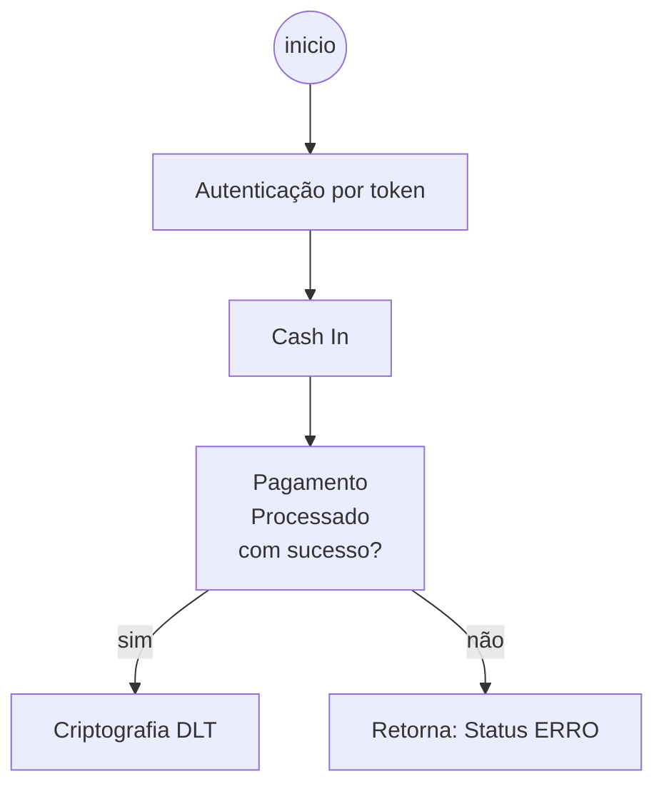

```mermaid
graph TD

	inicio((inicio)) --> atoken[Autenticação por token];
	atoken --> cashin[Cash In];
 	cashin --> pgto[Pagamento<br>Processado<br>com sucesso?];
 	
     pgto -- sim --> enc[Criptografia DLT];
     pgto -- não --> status_erro[Retorna: Status ERRO];
     
     
     
     
 
```

