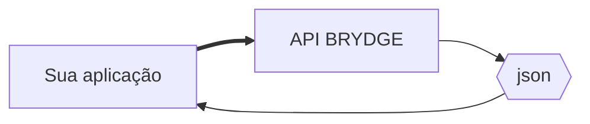
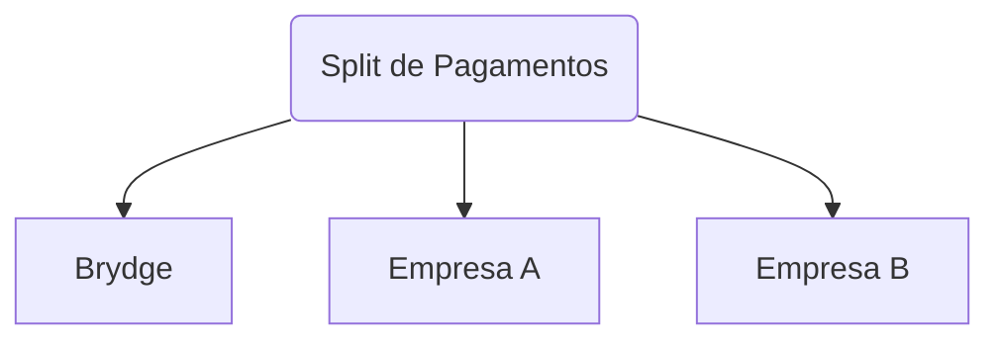

![Logo Brydge](data:application/octet-stream;base64,UklGRtYKAABXRUJQVlA4WAoAAAAQAAAAlgEAUgAAQUxQSNAHAAABoAXbtmm7GrFt27Zt2zYvYvPGurFtu1K2bedGL7adzI+cs/dcc62979NHREwA/j7v9070o7/RxpLsv9GGynr/L64wsZOly5gxfaoEUf8xCJ+j+fBNR++8/Ul/fnp6Zd+ynvVThdDFX7O0yyQuX7xwzsShfnWKp+Sps3C26jmzJg3vVr9kak+lNixkDlRSZiHvgtn258yeETikS/1SGcLqkMln3RPivb20eXIbDRfKPK9ZKRL9/c7OkdUS2FpKUn/e2T68QiyA2NspCPuRxD88MbVDNlEJfQ+R0m/bW8e0soIMzFBQlsePW9vEsjZejMdXa0pX/8j1KRLfBNL02qyqYYQUmPeZ1L+cktVboEshojeT0mhDRFffctEctpSk8YMJ2QXk3khSF6RyPUQ/J0bRR2VGrv06EdHWKorizCbBP0aFdT1Ef1Uy0EmmqqT9jkIqmr4k2bfKuR+iXuahejzP9COaFY0r9CKSPxKY4nZouHlehuEYRkZ8UIkn3SXScSv8XA/5GIfGMCQhUwZwFPlIeq5b6H4os3Eoib3txqC19kqTmzTOZfPstlWGDHoorI1i5C5NQ7WMQxXs/GUSOh7SUoafzvNl3kyFk4xz0jwPbfQls+6yEuEROe8ziNaOUhqH+lqK99MwNMXCdnLgl5EdpT0mmOZXHCsbyLj1vPiQ1i9d0SyMMw2tt1CYzPsjtodEpHWdXk62b+Bor6NGT9l0TcU2jDQOFfR2y0C0xcMOrVojQBeKYoJmsFlwNd8xDDPPDS9+ZOTiAIqS6of7l82YMXf9xQ8cP8oDk7jOHTyq9uT2CCboZgcYwnaKb0b2vB7z5K/UetFDWdTRQ/QfYpY1bOa5aevOg1ecVnUVwFk1R/xzhIbnWFWmP7XzMieAQK4EMCpbd3u4wHUAw7k6wXJEn6+ivkT+YymJrQ+bqdodUEKVUIxUbigOm1F8H1m6nAwqkjhUX661GM3VzxqQ8aUkmg8gF8n1swOg8ikV+7BOwbt6YIwy3sLeCFCSxqFacI3CeCHIKYqyAFe0AkYo+FbjOd/dlOCt8NbTSnh2Gf5c1eVgmahTaECaoQUffSb2R/HAnfzKH+PgTnYzfYkqqLgo6nVVO7TlU5gB/JHPEXWDO6lLzCshKOYnUbK5sFhcN6iMfMoH6iI6QjM7UXsSd3ZJuOM0Yd4IuwO5bFWzq8wS0hRLatX1Wqde617rnhL3Koi66TTwF9ZUP7VfoppC6ocoosI+1+78WmnhP4h6G9psH6I4S3GISk/M3wXl6SANS0QthtleOEtDyOrC9XSAmEsYL66RqGbBh2/VIOwh12vMk5Ib88WlE5U12HAoA4QtJu4riCVkOTBbXLjngt5FlzTEzdwpB+9svW3EWEbsi4HBIn5E1wFnBF0De7qKpWwXXutmbjeOq8zfStiCAU+JvzWAJxK6QIt9gk7yLSQzOgfR98BYim5s3OZ555lHpDQhgMoCgqDHDkFH+Ga5LqJXLdWI3Ys/96grrskeQcf5prkwokUmqOIhibKt0OS4oEvBCzoUTru78DxKVUJNQt0X9CJS8IKOAhP1quol9HM1Q6BJkl+CKF0wg5ZhhFb74L2mkqfQpRJJrh3coAzNdfqRwAKOqKiqzXhR0wz30hhvH1p/9PyXgkNTdaoOq6kV7Ic290U9NBxFM0WPkNZDRUpTZdo3LvqpUQ9Yn8SXSptKJLuiflP6D+Yf1jOsKTqDMc1pLo0HwGbYx1xjoM1lYaf1CwujsnXnQMRnhukI2we4smvjS9LraJfasdDHKA+Kw/4JrsK6ZCfx76Pplsa5CptkRhTIKaZJhjfy6Ihry26Ok9nBapby74n998gPbLQtpEsrZ47TMF2sCaTwCo7w0cnUDBPd0Hxz0CqztLCVIeAFqfRBSwX0tXtEW1MFpXas4mTSGkYZmiSl5xRps5VoM+4EqX0bFiFfKiB6GJDNSqxq818LCucILRhCd/ot7PKaPw+wfYxqEuEdAHRQQkQXl/ZtVrt2464zd70n0bMCRioePS6tAeYWqWC1fIWa/rPvkfSO8HiKizY51S38eV+RwWsYwIR9PSVno0YOld9Daacq5wr6eUJXtu8xHWkcPK/8GwAnuGiXEx2H13DP/wZIzkatnOdpDG/IGwz6rAx+bL/iOc3ndLDa2u3E02/zSHU4zkWHHeZjDlgf6jL8etidql/8VgKSsJGPozzIBLvj3AUZdxDGCoAPGyV1kP0xYX+Yq3hvmllAoAQcZTvtHKPA2in4MhrAeBGJfnNRT4e4VAbMJR5qsWO763nfGGLQkY1SO8HbfiHBHnOtvA/90dXtLEkKQTjEdsl8r8YngNImj2R9mJIYmOxu1hWBZymJfnHRYMOd9o0F1ZGHf5HzOCAhAAS6mHOD0sG7FLRno0wGuxpYECKTDH8uY1/ryPDoVq6s9c0Gy3O4RtrCIbYP0b0EcZWxsFrUpdV+OSE3escjyg73zQTv8/Spaoy3Qfc9P7gbdOPcoc1zR3QskQa2+wYxd7IX/1IQ82tfL+uDmPNZCAi6rv7KmQObZg9vVywVxGfrs+892/X5rVLBcv8gbYsaIwAhPIeE0aN7cf54VYauu/zJ0q9Xp1cNq5EOjiisH4LhMdOXrNW8Xfv2rRpUyp8sCpxT2NDgmGP/T8wPWSP/Rvsla9TfaFZQOCDgAgAA0BkAnQEqlwFTAD6RSKFLJaSjoaV3aDCwEgllbuFtEPUdv+V1iru/5a8Pl3d596wucxtgPMB9gHvGaaj6AH7Aeml7MP2gJQFcBKge/Yzy5DiuTdiZLwNdV2ozU40fVJ7O/Pf2wevF2CiHFnfUv9eBtyFjAgWX/lPzvzSvBdzvNJLVEr+5tTIoh43mpS3HGccnbKKXuLO/1KxRGuZDkVfnfX0A8ulqIcWd9SSkkVAZTeTAD9QlPPiHzOrKKXuLO/Pthsw+KUq+UQ1RMJkVUmnXWbFeBRS9w0AA/v4IIwLNfuskR5WJxZEjf52DgHXdkuMO3GTu0hftVorx+URl4d5eXP5cLnvW+cRyWeKZ8hJ/x6H4KvBrgODZsrJervX/niIkny+AqbKL0jatN5YtoW0u+Vbpx4KpJw4vlDGBiYf+mEY2LENU29N83rn8Rq/C6URj2FHV8VktjrTwqrc9snUNdwzu4kPQ82yEXw7dbigF9XW0ch1YfLKeOsTFEo//O4ZVHtwqnFLglSIMn8Wq0eeyfhyvPH81q9Z+3/0HL73A/RSpGOQYu1Z/7nj5KHxmNtJQefndL8AHWojN9lNoM75P9MzbbpwFvsSzYe8x2dZjYCRkKoFShnuHoW3sy62Fm4KZZbV03+uQHy07yP9050rtRAEFMC22yVhjRboULVM4GW/8R+375sTEb0ZA2ruBobeEqaVDqzOm5cuxkDZUro7AXQTf4ot//+L3cAxcSDzUwJiLff//yUhBdNWtJGrGLeBorF1nz4UhHR8J0AIerfXo5dlE+5fHZD6bUe+nrnwS7wyiPRFUCn1SxIJZVdNGrXCZyUockIdxPtYalRiG1JCIjw2qw6X8aAfbt9khBq4PIH7z7eLR+srnyNqTO5tAsVasgzPx1FovDkAzGJnXR4BDPIji+fSRAFb+syjoZu5zsl4GfBfpg1StWSJ3JxpCXdubGGi6LjAsj6IsMboQcAAAAA==)

# REST API Brydge

## Introdução

A API Brydge permite que aplicações externas se comuniquem com a plataforma Brydge. Este documento explica os métodos que estão disponíveis.

A API suporta JSON. Cada requisição é feita através dos métodos HTTP `GET` ou `POST` e precisam conter no `header` da requisição o token de autenticação  `APP_TOKEN`




## Autenticação

É necessário passar o parâmetro `API_TOKEN` no `HEADER` da requisição

**APP_TOKEN** - Token de autenticação fornecido com o seu perfil:

```c#
var client = new RestClient("https://api.brydge.io/");
var request = new RestRequest("nome-do-endpoint", Method.GET);
request.AddHeader("APP_TOKEN","Q5W64G564G65S4897R56EH4G56489FV78J7YTHRYH8VSD621");
var response = client.Execute(request); // acessar endpoint 
```

## Modo Sandbox

A API Brydge possui o ambiente de produção e o ambiente de Sandbox. Ambos possuêm os mesmos Endpoints. Para acessar em modo sandbox é necessário utilizar a seguinte url:

```C#	
var client = new RestClient("https://sandbox.api.brydge.io/");
```


## Formato de requisição

>  A maioria dos endpoints seguem um mesmo padrão de formato

### Trazer todos os Itens

```C#
//GET todo os Itens
var request = new RestRequest("nome-do-endpoint", Method.GET);
request.AddHeader("APP_TOKEN","Q5W64G564G65S4897R56EH4G56489FV78J7YTHRYH8VSD621");
var response = client.Execute(request);
```


### Trazer um único item pelo ID

```c#
//GET item por ID
var request = new RestRequest("nome-do-endpoint/{id}", Method.GET); 
request.AddHeader("APP_TOKEN","Q5W64G564G65S4897R56EH4G56489FV78J7YTHRYH8VSD621");
request.AddUrlSegment("id", "d52e3cff-afdb-4896-9c84-900a16cabb43");
var response = client.Execute(request);
```


### Criar um Item

```c#
//POST item
var request = new RestRequest("nome-do-endpoint", Method.POST);
request.AddHeader("APP_TOKEN","Q5W64G564G65S4897R56EH4G56489FV78J7YTHRYH8VSD621");
request.AddBody(new { A = "AA", B = "BB" });
var response = client.Execute(request);
```


### Atualizar um Item

```c#
//PUT item
var request = new RestRequest("nome-do-endpoint/{id}", Method.PUT); 
request.AddHeader("APP_TOKEN","Q5W64G564G65S4897R56EH4G56489FV78J7YTHRYH8VSD621");
request.RequestFormat = DataFormat.Json;
request.AddUrlSegment("id", "d52e3cff-afdb-4896-9c84-900a16cabb43");
request.AddBody(new { A = "AA", B = "BB" });
//mande apenas os campos que precisam ser atualizados
var response = client.Execute(request);
```


### Apagar um item

```c#
//DELETE item
var request = new RestRequest("nome-do-endpoint/{id}", Method.DELETE); 
request.AddHeader("APP_TOKEN","Q5W64G564G65S4897R56EH4G56489FV78J7YTHRYH8VSD621");
request.AddUrlSegment("id", "d52e3cff-afdb-4896-9c84-900a16cabb43");
var response = client.Execute(request);
```


# Endpoints

## Listar Bandeiras de Cartões de Crédito

**Método**: `GET`

**URL** ```/ListCardBrand```

**Resposta**

 ```json
{
   "status":"success",
   "brands":[
      {
         "BAND_ID":"ff08fb93-29a6-4dc8-9de5-1447c630bb1b",
         "BAND_NOME":"Visa"
      },
      {
         "BAND_ID":"0c6601b6-3fd9-4ec2-84fc-2a9f6b022ae9",
         "BAND_NOME":"MasterCard"
      }
   ]
}

 ```


## Listar Cartões de Crédito

**Método**: `GET`

**URL**  `/ListCards`

**Resposta**

 ```json
{
   "status":"success",
   "cards":[
      {
         "CARD_ID":"a395ee07-b03b-42b1-80f3-15c69a7a2e35",
         "CARD_ULTIMOS_DIGITOS":1234,
         "BAND_ID":"ff08fb93-29a6-4dc8-9de5-1447c630bb1b"
      }
   ]
}
 ```


## Cash-in Cartão de Crédito

**Método**: `POST`

**URL** `/CashIn`

**Parâmetros** POST (Json)

 - **TRA_VALOR** - valor da transação

 - **CARD_ID** - ID do cartão de crédito (quando já cadastrado)

   ou

 - **CARD_NUMERO** - Numero do cartão de crédito

 - **CARD_NOME** - Nome do portador do cartão

 - **CARD_CVC** - Código de segurança

 - **CARD_MES_VENCIMENTO** - Mas de vencimento do cartão 

 - **CARD_ANO_VENCIMENTO** - Ano de vencimento do cartão 

 - **CARD_CREDITO** - true/false para função crédito do cartão 

 - **BAND_ID** - ID da bandeira do cartão, pode ser obtido através do endpoint ```ListCardBrand```

**Body da requisição**

```json
{
    "TRA_VALOR":1000.00,
    "CARD_ID": "d52e3cff-afdb-4896-9c84-900a16cabb43"    
}
```

**Body da requisição** (Cadastrando novo cartão)

```json
{
    "TRA_VALOR":1000.00,
    "CARD_NUMERO": 5540680226435183,
    "CARD_NOME": "NOME ESCRITO NO CARTÃO",
    "CARD_CVC": 956,
    "CARD_MES_VENCIMENTO":07,
    "CARD_ANO_VENCIMENTO":2020,
    "BAND_ID":"ff08fb93-29a6-4dc8-9de5-1447c630bb1b"
}
```


**Resposta Sucesso**

```json
{	
	"status":"success",
	"message":"Transação realizada com sucesso"
}
```

**Resposta Erro**

```json
{	
	"status":"error",
	"message":"Não foi possível realizar a transação"
}
```

## Pagamentos com split




> O **Split de Pagamentos** permite a divisão de uma transação entre diferentes participantes de uma venda

**Método**: `POST`

**URL: **  `/PagamentoComSplit`

**Parâmetros** POST (Json)

 - **TRA_VALOR** - valor da transação
 - **CARD_NUMERO** - Numero do cartão de crédito
 - **CARD_NOME** - Nome do portador do cartão
 - **CARD_CVC** - Código de segurança
 - **CARD_MES_VENCIMENTO** - Mas de vencimento do cartão 
 - **CARD_ANO_VENCIMENTO** - Ano de vencimento do cartão 
 - **CARD_CREDITO** - true/false para função crédito do cartão 
 - **BAND_ID** - ID da bandeira do cartão, pode ser obtido através do endpoint ```ListCardBrand```
 - **EMPRESAS** -  objeto com os IDs das empresas que estão participando da venda

**Body da requisição** 

```json
{
  "TRA_VALOR": 1000.00,
  "CARD_NUMERO": 5540680226435183,
  "CARD_NOME": "NOME ESCRITO NO CARTÃO",
  "CARD_CVC": 956,
  "CARD_MES_VENCIMENTO": 7,
  "CARD_ANO_VENCIMENTO": 2020,
  "BAND_ID": "ff08fb93-29a6-4dc8-9de5-1447c630bb1b",
  "EMPRESAS": [  "d58d2036-0733-4c5a-baf6-583ef528c257", "11010739-c4b5-4fff-ba57-7a735be3e1b5" ]
}
```

## Listar Empresas Participantes

**Método**: `GET`

**URL: **  `/empresa/`

```json
[
    {
        "EMP_ID":"d58d2036-0733-4c5a-baf6-583ef528c257",
        "EMP_NOME":"Empresa A"
    }, 
    {
        "EMP_ID":"11010739-c4b5-4fff-ba57-7a735be3e1b5",
        "EMP_NOME":"Empresa B"
    }
]
```

## Dados de uma empresa por ID

**Método**: `GET`

**URL: **  `/empresa/{id}`

```json
{
        "EMP_ID":"d58d2036-0733-4c5a-baf6-583ef528c257",
        "EMP_NOME":"Empresa A"
} 
```


## Cadastrar Empresa Participante

**Método**: `POST`

**URL: **  `/empresa/`

**Parâmetros** POST (Json)

 - **EMP_MDR** - Merchant Discount Rate (%)
 - **EMP_TARIFA** - Tarifa fixa em Reais (R$)

**Body da Requisiçao**

```json
{
      "EMP_MDR": 3.5,
      "EMP_TARIFA": 0.30
}
```


**Resposta Sucesso**

```json
{	
	"status":"success",
	"message":"Cadastro realizado com sucesso",
    "EMP_ID":"d58d2036-0733-4c5a-baf6-583ef528c257"
}
```

**Resposta Erro**

```json
{	
	"status":"error",
	"message":"Não foi possível cadastrar empresa"
}
```
